# LLSegmentViewController

## 要求

- iOS 8.0+
- Xcode 9
- Swift

## 使用CocoaPods安装
```
pod 'LLSegmentViewController'
```

## 特征
1、预加载控制器View
```Swift
pageView.preLoadRange = 1...3 //当前控制器的左边预加载1个，右边预加载3个
```
2、红点设置简单，跟当前控制器绑定，不再需要写额外控制代码
```Swift
self.tabBarItem.badgeValue = "\(indexPath.row)"//红点设置为LLSegmentRedBadgeValue
```
3、自定义性强：参考自定义样式

## 项目中的使用
```Swift
class SimpDemoViewController: LLSegmentViewController {
    override func viewDidLoad() {
        super.viewDidLoad()
        loadSegmentedConfig()
    }
}

extension SimpDemoViewController{
    func loadSegmentedConfig() {
        layoutContentView()
        loadCtls()
        setUpSegmentStyle()
    }

    func layoutContentView() {
        self.layoutInfo.segmentControlPositionType = .top(size: CGSize.init(width: UIScreen.main.bounds.width, height: 44),offset:0)
        self.relayoutSubViews()
    }

    func loadCtls() {
        let introCtl = UIViewController()
        introCtl.title = "简介"
        introCtl.view.backgroundColor = UIColor.yellow
        
        let catalogCtl = UIViewController()
        catalogCtl.title = "目录"
        catalogCtl.view.backgroundColor = UIColor.red
        
        let ctls =  [introCtl,catalogCtl]
        reloadViewControllers(ctls:ctls)
    }

    func setUpSegmentStyle() {
        let itemStyle = LLSegmentItemTitleViewStyle()
        itemStyle.selectedColor = UIColor.init(red: 50/255.0, green: 50/255.0, blue: 50/255.0, alpha: 1)
        itemStyle.unSelectedColor = UIColor.init(red: 136/255.0, green: 136/255.0, blue: 136/255.0, alpha: 1)
        itemStyle.selectedTitleScale = 1
        itemStyle.titleFontSize = 15
        itemStyle.itemWidth = UIScreen.main.bounds.width/CGFloat(ctls.count)//如果不指定是自动适配的
        //这里可以继续增加itemStyle的其他配置项... ...

        segmentCtlView.backgroundColor = UIColor.white
        segmentCtlView.separatorLineShowEnabled = true //间隔线显示，默认不显示
        //还有其他配置项：颜色、宽度、上下的间隔...

        segmentCtlView.bottomSeparatorStyle = (1,UIColor.red) //分割线:默认透明色
        segmentCtlView.indicatorView.widthChangeStyle = .stationary(baseWidth: 11)//横杆宽度:有默认值
        segmentCtlView.indicatorView.centerYGradientStyle = .bottom(margin: 0)//横杆位置:有默认值
        segmentCtlView.indicatorView.shapeStyle = .custom //形状样式:有默认值

        var segmentedCtlStyle = LLSegmentedControlStyle()
        segmentedCtlStyle.segmentItemViewClass = LLSegmentItemTitleView.self  //ItemView和ItemViewStyle要统一对应
        segmentedCtlStyle.itemViewStyle = itemStyle
        segmentCtlView.reloadData(ctlViewStyle: segmentedCtlStyle)
    }
```


## 自定义
只需两步就可完成自定义效果：(可参考项目内的自定义样式)
-  1、继承LLSegmentBaseItemView或子类；
-  2、实现LLSegmentBaseItemView以下方法（有些方法可实现可不实现）

```Swift
//1、设置标题
public func titleChange(title:String)
//2、滚动时会调用这个方法，percent的取值范围是0...1
public func percentChange(percent:CGFloat)
//3、返回当前ItemView的宽度
public func itemWidth() ->CGFloat
//4、设置Item的style样式
public func setSegmentItemViewStyle(itemViewStyle:LLSegmentItemViewStyle) 
```

## 效果预览

### 详情页效果预览

说明 | Gif |
----|-------|
个人中心头部放大  |  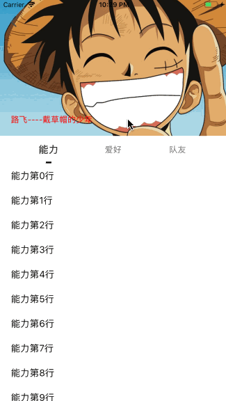 | 
个人中心列表刷新  |  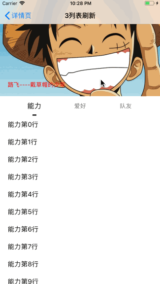 | 
商品详情  |  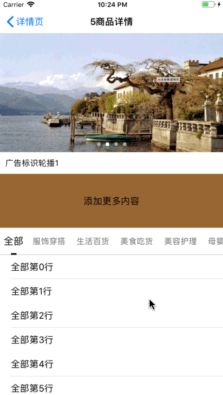 | 

### 指示器效果预览

说明 | Gif |
----|------|
LineView固定宽度  |  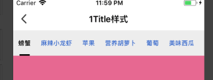 |
LineView京东风格  |  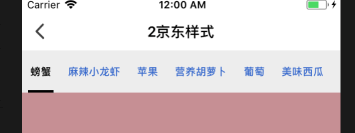 |
LineView爱奇艺风格  |  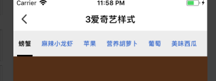 |
LineView回旋风格  |  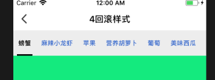 |
LineView与Item等宽  |  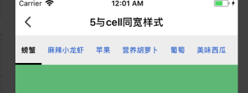 |
LineView分割线  |  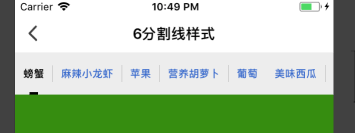 |
LineView背景  |  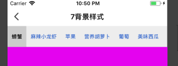 |
LineView椭圆形  |   |
LineView椭圆形加阴影  |   |
LineView文字遮罩  |  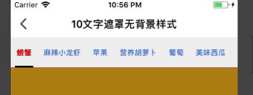 |
LineView文字遮罩加背景  |  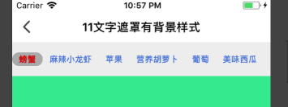 |
LineView文字遮罩加背景和阴影  |  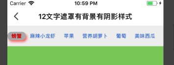 |
LineView三角形  |  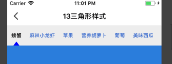 |
LineView小红点加数字  |  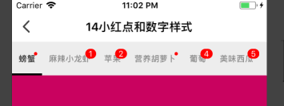 |
LineView点线效果  |  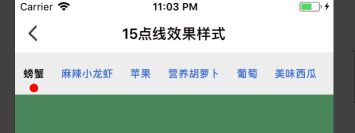 |
LineViewQQ红点  |  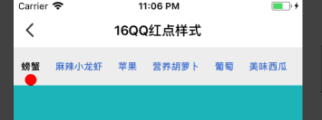 |

### 特殊效果预览

说明 | Gif |
----|------|
LineView嵌套  |  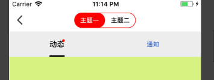 |
LineView足球  |  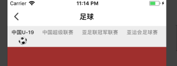 |
LineView插入  |  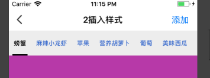 |
LineView混合  |  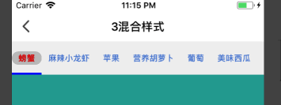 |
LineView图片做背景  |  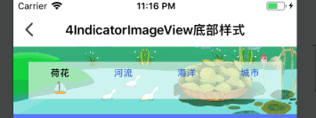 |
LineView图片文字  |  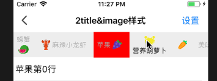 |

### 自定义Item效果预览

说明 | Gif |
----|------|
LineView背景色渐变  |  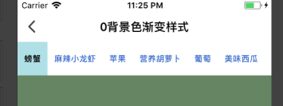 |
LineView富文本  |  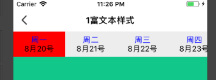 |
LineView网易新闻 |  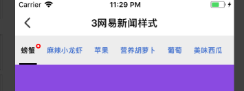 |

### 自定义tabbar效果预览

说明 | Gif |
----|------|
LineView微信  |  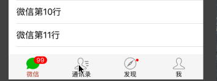 |
LineView微博  |  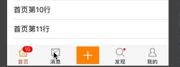 |
LineView图片做背景  |  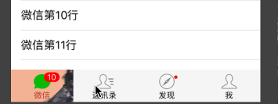 |


邮箱：736764509@qq.com </br>
QQ群： 142649183

 


